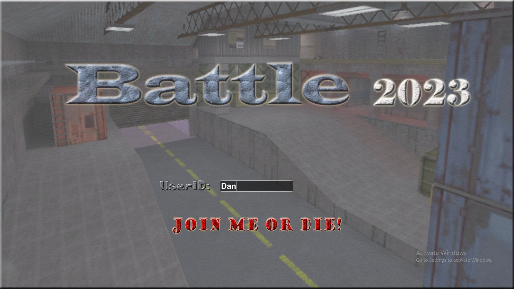
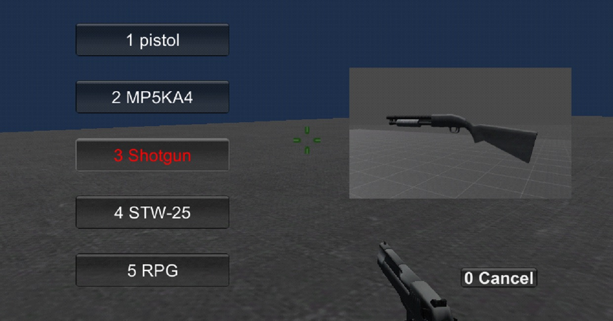

Counter Strike
=====

## Purpose
The purpose is to make that users feel enjoyment through this game to perform matches with computer players or other users in LAN.

## Description

This project is very interesting and very comfortable for users.      
                         

    

There are several weapons and two team.
Users can select only one team and when game is started, they can buy weapons.
Weapons contain pistol, machine gun, missile and so on.
Users can kill or be dead from other users.
Each weapon has its stacks and bullets and if users have enough stack or bullet, they can not fight with weapons except knife.
If users want to kill other users with knife, they must be close with other users.
And if all members of one team are killed by other team, the game will be started again and it will be counted.

    

## Technical specifications
This project has the following technical specifications.

-UI part
*	Menu screen using image button
* GUI buttons or labels using GUISkin

-Main game part
*	Multi game using Tarashen network package.
* Weapons made by 3DMax
* Character animation made by Maya
* Blood effect using Dynamic package.
* Fire effect using particle in Unitys
